# ft_lex

`ft_lex` is a full implementation of the POSIX `lex` utility — a **lexical analyzer generator**. Given a `.l` specification file containing regular expressions paired with C (or Python) actions, it produces a complete, self-contained scanner (`lex.yy.c` or `lex.yy.py`) built around a compiled **Deterministic Finite Automaton (DFA)**. 

The project covers everything from regex parsing through NFA/DFA construction, multi-language code generation, a runtime support library (`libl`), and optional DFA table compression.

---

## Table of Contents

1. [Quick Start](#quick-start)
2. [Architecture Overview](#architecture-overview)
3. [Phase 1 — `.l` File Parsing (`LexerParser`)](#phase-1--l-file-parsing-lexerparser)
4. [Phase 2 — Regex Tokenization & Postfix Conversion (`RegexParser`)](#phase-2--regex-tokenization--postfix-conversion-regexparser)
5. [Phase 3 — NFA Construction (Thompson's Construction)](#phase-3--nfa-construction-thompsons-construction)
6. [Phase 4 — DFA Construction (Subset Construction)](#phase-4--dfa-construction-subset-construction)
7. [Phase 5 — Code Generation (`AGenerator`, `CGenerator`, `PythonGenerator`)](#phase-5--code-generation-agenerator-cgenerator-pythongenerator)
8. [The Runtime Library (`libl`)](#the-runtime-library-libl)
9. [Bonus: DFA Compression (`-Ce` / `-Cm` / `-CF`)](#bonus-dfa-compression--ce---cm---cf)
10. [Bonus: Python Target (`-l python`)](#bonus-python-target--l-python)

---

## Quick Start

```sh
# Build
make

# Generate a C scanner from a .l specification
./ft_lex scanner.l          # writes lex.yy.c

# Compile and link the scanner with libl
clang -o scanner lex.yy.c -L. -ll

# Run it
echo "42 + 1337" | ./scanner

# Generate a compressed scanner (equivalence classes + meta-ECs)
./ft_lex -CF scanner.l      # same as -Cem

# Generate a Python scanner
./ft_lex -l python scanner.l    # writes lex.yy.py
```

## Project File Structure

```
ft_lex/
├── Makefile
├── include/
│   ├── ft_lex.hpp          # CompressionConfig struct
│   ├── LexerParser.hpp     # .l file parser
│   ├── RegexParser.hpp     # Regex tokenizer + shunting-yard
│   ├── Token.hpp           # Token types (CHAR, CHARSET, OPERATOR, INTERVAL, ...)
│   ├── NFA.hpp             # NFA state + Thompson's construction
│   ├── DFA.hpp             # DFA state + subset construction
│   ├── AGenerator.hpp      # Abstract code generator base
│   ├── CGenerator.hpp      # C code generator (+ EC/MetaEC compression)
│   ├── PythonGenerator.hpp # Python code generator
│   ├── template.hpp        # Extern declarations for embedded template blobs
│   └── utils.hpp           # String utility helpers
├── src/
│   ├── main.cpp            # Argument parsing + pipeline orchestration
│   ├── LexerParser.cpp
│   ├── RegexParser.cpp
│   ├── NFA.cpp
│   ├── DFA.cpp
│   ├── AGenerator.cpp      # Template loading + placeholder injection
│   ├── CGenerator.cpp      # C table emission + EC/MetaEC algorithms
│   ├── PythonGenerator.cpp # Python table emission + action translation
│   ├── data.template.cpp   # Auto-generated: embedded template byte arrays
│   ├── utils.cpp
│   └── libl/               # Runtime support library
│       ├── libl.h          # Shared variable externs + function declarations
│       ├── main.c          # Weak main() -> yylex() + yylex_destroy()
│       ├── yywrap.c        # Weak yywrap() -> return 1
│       ├── input.c         # input(): raw char read with line tracking
│       ├── unput.c         # unput(c): push character back
│       ├── yyless.c        # yyless(n): shorten current match
│       ├── yymore.c        # yymore(): extend current match
│       └── yylex_destroy.c # (Moved to template) yylex_destroy(): free buffers
├── template/
│   ├── template.c          # C scanner template (with __PLACEHOLDER__ markers)
│   └── template.py         # Python scanner template (with __PLACEHOLDER__ markers)
└── tests/
    ├── parser/             # Example .l specification files
    ├── text/               # Input text files for scanner testing
    └── test_runner.sh      # Automated test harness
```

## Command-Line Reference

```
./ft_lex [-vntcfF] [-o file] [-l lang] [-C mode] <lexer.l> [...]
```

| Flag | Description |
|---|---|
| `-v` | Verbose: print DFA statistics (state/transition counts, compression mode) to stderr |
| `-n` | No-op (POSIX compliance — suppresses the default informational summary) |
| `-c` | No-op (POSIX compliance — C is already the default target language) |
| `-t` | Write generated code to **stdout** instead of a file |
| `-o file` | Output filename (default: `lex.yy.c` for C, `lex.yy.py` for Python) |
| `-l c` | Target language: C (default) |
| `-l python` | Target language: Python |
| `-f` / `-Cf` | Full DFA tables, no compression (default) |
| `-Ce` | Enable equivalence class compression |
| `-Cm` | Enable meta-equivalence class compression (implies `-Ce`) |
| `-F` / `-CF` | Fast tables — equivalence + meta-EC (equivalent to `-Cem`) |

Multiple `.l` files may be provided; they are concatenated in order with unified line-number tracking for error reporting.

---

## Architecture Overview

The full pipeline transforms a textual `.l` specification into a running lexer in five phases. Each phase is self-contained and feeds into the next.

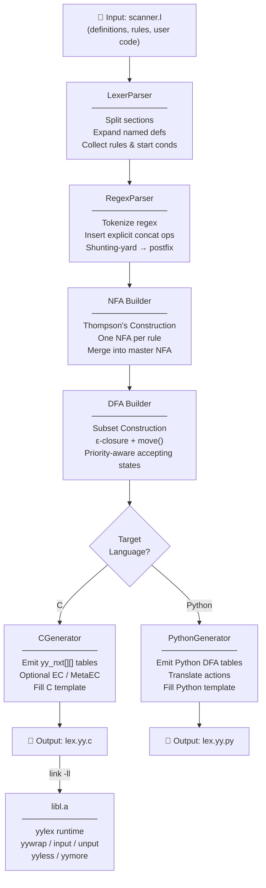

---

## Phase 1 — `.l` File Parsing (`LexerParser`)

**Source:** `src/LexerParser.cpp`, `include/LexerParser.hpp`

A `.l` file is divided into three sections by `%%` delimiters:

```
%{
/* C code pasted verbatim into the output */
#include <stdio.h>
%}

/* Named definitions */
DIGIT  [0-9]
ALPHA  [a-zA-Z]

%%

/* Rules */
{DIGIT}+   { printf("NUMBER: %s<br>", yytext); }
{ALPHA}+   { printf("WORD: %s<br>", yytext); }

%%

/* User code appended to the output */
int main(void) { return yylex(); }
```

### What `LexerParser` does

1. **File concatenation** — accepts multiple `.l` files; tracks per-file line boundaries for accurate error messages (e.g., `scanner.l:12:3: error: unknown start condition 'FOO'`).
2. **Section splitting** — finds the first `%%` (start of rules) and optional second `%%` (start of user code).
3. **`%{ ... %}` extraction** — pulls verbatim C/Python blocks out of the definitions section and stores them as `_definitions`.
4. **Named definitions** (`NAME  regex`) — stored in `_namedDefinitions` and lazily expanded inside rule regexes with `_expandDefinitions()`. Expansion is iterative to support chained references.
5. **Start conditions** — `%s NAME` (inclusive) and `%x NAME` (exclusive) are parsed into `_startConditions`. Rules prefixed with `<COND>` are tagged accordingly; a rule with no prefix applies only in inclusive conditions.
6. **Directives** — handles `%array` (default, fixed-size `yytext`) and `%pointer` (char pointer `yytext`).
7. **Rule extraction** — for each rule, the parser carefully walks character-by-character respecting bracket classes `[...]`, quoted strings `"..."`, escape sequences `\\` (including octal and hex), and brace-delimited actions `{...}`. The `|` continuation syntax (action shared with the next rule) is resolved in a post-processing pass.
8. **`<<EOF>>` rules** — mapped by start-condition index into `_eofActions`. Action code is wrapped in `if/else if` blocks (like regular rules) so that `return` escapes `yylex()`.

### `.l` parsing flow

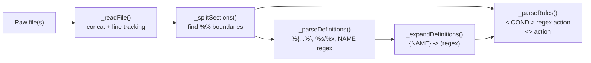

---

## Phase 2 — Regex Tokenization & Postfix Conversion (`RegexParser`)

**Source:** `src/RegexParser.cpp`, `include/RegexParser.hpp`

Each rule's regex string is converted to a **postfix (Reverse Polish Notation)** token stream using a classic **shunting-yard algorithm**. This form is directly consumable by the NFA builder without needing a recursive AST.

### Supported regex syntax

| Syntax | Meaning |
|---|---|
| `c` | Literal character |
| `.` | Any character except `\n` (expands to a charset of 255 chars) |
| `[abc]` | Character class |
| `[^abc]` | Negated character class (supports full 0-255 range) |
| `[[:alpha:]]` | POSIX character class (`alpha`, `digit`, `alnum`, `upper`, `lower`, `space`, `blank`, `print`, `graph`, `cntrl`, `xdigit`, `punct`). Locale-aware. |
| `[[.ch.]]` | Collating element (single characters supported) |
| `[[=a=]]` | Equivalence class (single characters supported) |
| `"string"` | Literal string (special chars treated as literals) |
| `\n \t \r \v \f \a` | Escape sequences (including Alert/Bell) |
| `\012` | Octal escape (1-3 digits) |
| `\x41` | Hex escape (1 or more digits) |
| `r*` | Kleene star (zero or more) |
| `r+` | One or more |
| `r?` | Zero or one |
| `r{n,m}` | Repeat n to m times |
| `r{n}` | Exactly n times |
| `r{n,}` | n or more times |
| `r1r2` | Concatenation |
| `r1\|r2` | Alternation |
| `(r)` | Grouping |
| `^r` | Anchor — match at beginning of line (BOL) |
| `r$` | Anchor — match at end of line |
| `r1/r2` | Trailing context — match `r1` only when followed by `r2` |

### Tokenization steps

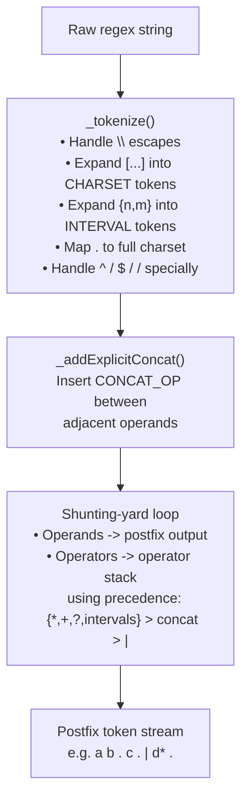

**Operator precedence** (highest to lowest):

```
3  ->  *  +  ?  {n,m}   (quantifiers / intervals)
2  ->  .                 (explicit concatenation, injected internally)
1  ->  |                 (alternation)
0  ->  /                 (trailing context, lowest -- splits NFA in two)
```

---

## Phase 3 — NFA Construction (Thompson's Construction)

**Source:** `src/NFA.cpp`, `include/NFA.hpp`

Thompson's Construction reads the postfix token stream and builds an **NFA** using a stack of partial NFAs. Each token pops operands off the stack, builds a fragment, and pushes the result back.

### NFA State structure

Each `State` node carries:
- `id` — globally unique integer (shared counter across all rules)
- `transitions` — `multimap<int, State*>` mapping a character code to a target state; the integer type allows special codes 256 (BOL anchor) and 257 (EOL anchor) beyond the normal 0–255 byte range
- `epsilonTransitions` — `vector<State*>` for ε-moves
- `isAccepting`, `priority`, `action` — inherited by the corresponding DFA state on accepting transitions
- `trailingContextBoundary` — marks the split-point for `/` trailing context

### Thompson's Construction Fragments

Each regex operator is converted into a small NFA fragment. These fragments are then composed to build the final automaton.

#### 1. Single Character / Charset
Basic transition from a start state to an accepting state.
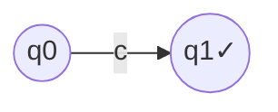

#### 2. Concatenation (`r1r2`)
The end of the first NFA is connected to the start of the second via an ε-transition.
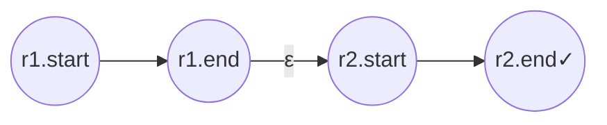

#### 3. Alternation (`r1|r2`)
A new start state splits into both NFAs, and both NFAs merge into a new end state.
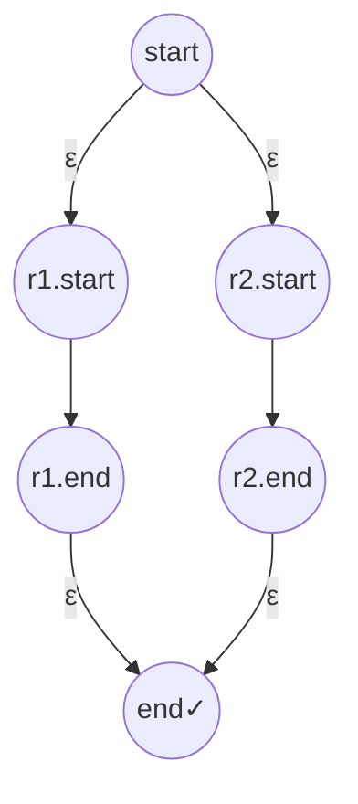

#### 4. Kleene Star (`r*`)
Supports zero or more repetitions. Includes a loop-back and a skip-ahead path.
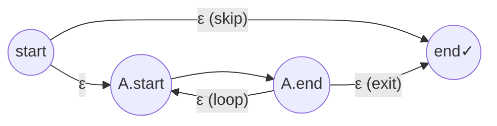

#### 5. One-or-More (`r+`)
Similar to Kleene star but requires at least one match (no initial skip path).
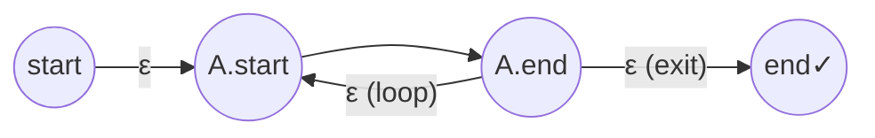

#### 6. Zero-or-One (`r?`)
Provides an optional path that skips the NFA entirely.
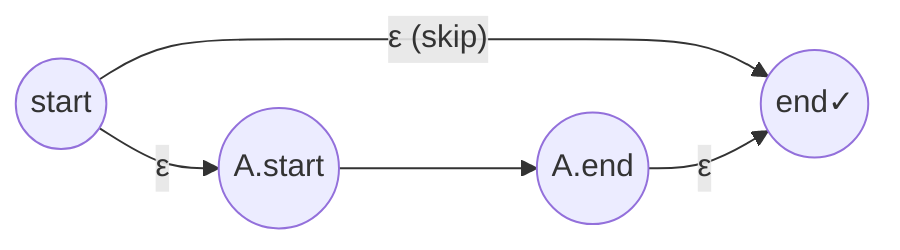

#### 7. Trailing Context (`r1/r2`)
Matches `r1` but only if `r2` follows. The boundary between them is marked for backtracking.
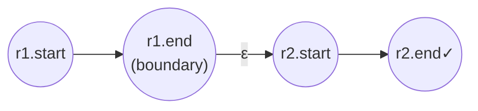

| Operation | Factory method | Description |
|---|---|---|
| Single character | `makeChar(c)` | Single transition on `c` |
| Character set | `makeSet(set<int>)` | Multiple transitions on all `c ∈ set` |
| Concatenation | `makeConcat(left, right)` | `left.end --ε--> right.start` |
| Alternation `\|` | `makeUnion(top, bottom)` | ε-transitions to both starts, both ends to new end |
| Kleene star `*` | `makeKleene(nfa)` | Zero or more (includes ε-skip and loop) |
| One-or-more `+` | `makePlus(nfa)` | One or more (loop back, no initial skip) |
| Zero-or-one `?` | `makeOption(nfa)` | Union with empty path |
| Repeat `{n,m}` | `makeRepeat(nfa, n, m)` | Concatenates `n` copies, then `m-n` optional copies |
| Any char `.` | `makeAnyChar()` | Transitions for all chars 0-255 except `\n` |
| Trailing context `/` | `makeTrailingContext(r1, r2)` | `r1 --ε--> r2`, marks `r1.end` as boundary |

### Master NFA per start condition

After all rules for a given start condition are converted, they are wired into a **single master NFA**:

- A fresh `masterStart` state gets ε-transitions to every individual rule's NFA start.
- A `bolStart` state (reachable from `masterStart` via character code 256) handles `^`-anchored rules.
- Each rule's NFA accept state carries its **priority** (rule index, zero-based) and **action** string. When multiple NFA accepting states collapse into one DFA state, the one with the **lowest priority number wins** — implementing POSIX first-match-wins.

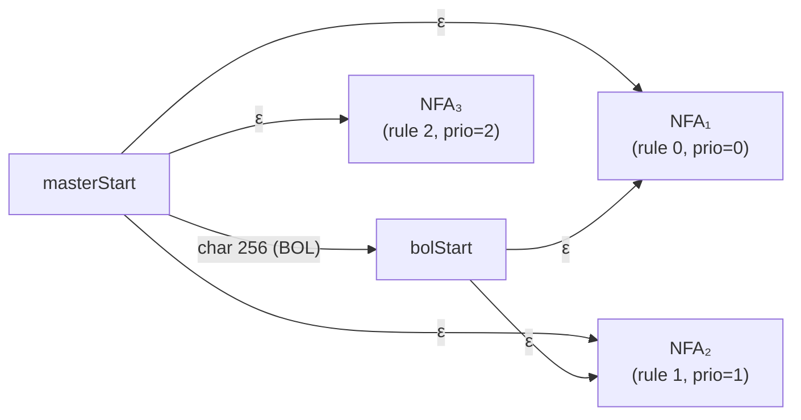

---

## Phase 4 — DFA Construction (Subset Construction)

**Source:** `src/DFA.cpp`, `include/DFA.hpp`

The **Subset Construction** converts the NFA — which can occupy multiple states simultaneously — into a DFA where each state is a *set* of NFA state IDs. No ε-transitions exist in the resulting DFA.

### Algorithm

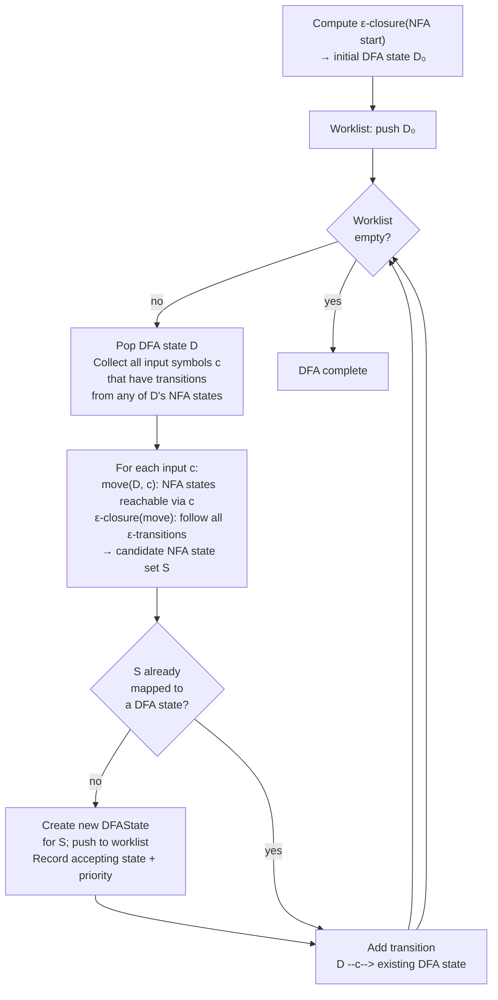

**Key implementation details:**

- `_epsilonClosure(states)` — iterative stack-based closure; follows all ε-transitions transitively until no new states are discovered.
- `_move(states, c)` — returns the set of NFA states reachable from the given set by consuming exactly one character `c`.
- DFA states are deduplicated by their `set<int>` of constituent NFA state IDs using a `std::map`, giving O(log n) lookup.
- **Accepting state resolution**: when a collapsed DFA state contains multiple accepting NFA states from different rules, the rule with the **lowest `priority`** is selected — first-rule-wins per POSIX.
- **Trailing context**: the `trailingContextBoundary` flag propagates from NFA into DFA states, allowing the generated `yylex()` to distinguish the end-of-match from the end-of-lookahead positions.
- **One DFA per start condition**: `main.cpp` runs the full NFA→DFA pipeline once per start condition, producing an independent DFA stored in `std::vector<DFA> dfas`.

### Example: keyword vs. identifier

To illustrate how the DFA handles overlapping rules, consider these two rules:

```
"if"        { return KW_IF; }
[a-z]+      { return IDENTIFIER; }
```

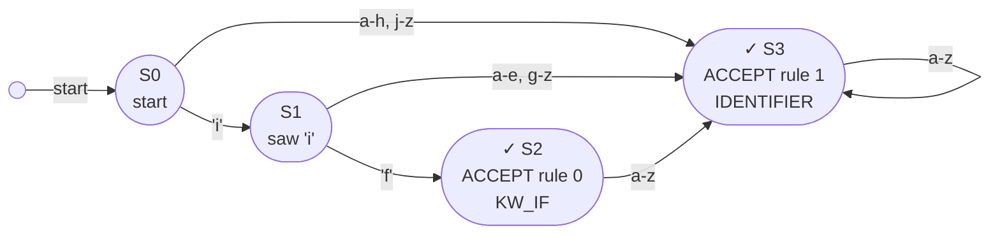

Tracing `"iffy"`:
1. `'i'` → S0→S1 (partial match for both rules)
2. `'f'` → S1→S2 (matches `"if"`, rule 0)
3. `'f'` → S2→S3 (no longer `"if"`; now only identifier rule matches)
4. `'y'` → S3→S3 (still identifier)
5. EOF — longest match was `"iffy"` in S3 → fires **rule 1** (IDENTIFIER)

---

## Phase 5 — Code Generation (`AGenerator`, `CGenerator`, `PythonGenerator`)

**Source:** `src/AGenerator.cpp`, `src/CGenerator.cpp`, `src/PythonGenerator.cpp`

Code generation is driven by a **template + placeholder injection** pattern.

### Template system

Templates for both C and Python are compiled into the `ft_lex` binary as raw byte arrays via `src/data.template.cpp` (auto-generated from `template/template.c` and `template/template.py` during the build). `AGenerator::loadTemplate()` selects the right blob by key at runtime — no external file I/O needed.

`AGenerator::generate()` then calls five virtual methods and splices their output into five named placeholders in the template string:

| Placeholder | Generated content |
|---|---|
| `__HEADER_PLACEHOLDER__` | `#include` directives + verbatim `%{ %}` definitions block |
| `__TABLES_PLACEHOLDER__` | DFA transition tables, accept arrays, start-condition index array |
| `__YYLEX_BODY_PLACEHOLDER__` | `yylex()` switch dispatching to per-rule action code |
| `__EOF_ACTION_PLACEHOLDER__` | `<<EOF>>` rule handler |
| `__USER_CODE_PLACEHOLDER__` | Verbatim user code from below the second `%%` |

### C table layout (full tables, `-Cf`)

For a DFA with *N* total states across all start conditions, `CGenerator` emits:

```c
/* Starting state index for each start condition */
static const int yy_sc_start[] = { 0, N0, N0+N1, ... };

/* Accept action index per DFA state (0 = non-accepting) */
static const int yy_accept[] = { 0, 1, 0, 2, ... };

/* 2-D transition table: state x input symbol (0..257) */
/* -1 means no transition (dead state) */
static const int yy_nxt[][258] = {
    { /* state 0 */ -1, 3, -1, ... },
    { /* state 1 */ ... },
    /* ... */
};
```

The generated `yylex()` driver uses these at runtime:

```c
int state = yy_sc_start[yy_start];  /* select DFA for current start condition */
while (1) {
    int c = yy_read_char();
    int next = yy_nxt[state][(unsigned char)c];
    if (next == -1) break;           /* dead end: backtrack to last accept */
    state = next;
    if (yy_accept[state]) last_accept = state;
}
/* dispatch action for last_accept (longest match) using if/else if chain */
```

---

## The Runtime Library (`libl`)

**Source:** `src/libl/`, compiled into `libl.a`

POSIX requires that a `lex` implementation ship a **companion library** linked with `-ll`. `ft_lex` provides `libl.a`, containing six C translation units.

### Global variables

These are declared `extern` in the generated scanner and defined once in `libl`:

| Variable | Type | Purpose |
|---|---|---|
| `yyin` | `FILE *` | Input stream (default: `stdin`) |
| `yyout` | `FILE *` | Output stream (default: `stdout`) |
| `yytext` | `char *` or `char[]` | Current token string (Type depends on `%pointer` / `%array` mode) |
| `yyleng` | `int` | Length of `yytext` |
| `yylineno` | `int` | Current source line number (tracked during DFA scan and backtracking) |
| `yy_start` | `int` | Active start condition index |
| `yy_at_bol` | `int` | 1 if at beginning of line |
| `yy_more_flag` / `yy_more_len` | `int` | Internal state for `yymore()` |
| `yy_hold_char` / `yy_hold_char_restored` | `unsigned char` / `int` | Hold-char mechanism for input pushback |

### Library functions

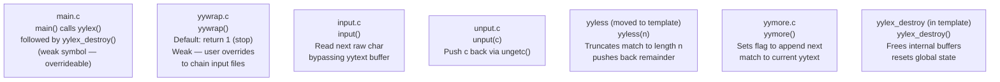

#### `main()` — weak entry point

`main.c` declares `main()` with `__attribute__((weak))`. If the user supplies no `main()`, the library's default calls `yylex()` then `yylex_destroy()`.

#### `yylex_destroy()` — memory cleanup

(Implemented in `template.c`). Frees the dynamic `yy_buffer` and resets all global lexer state (line numbers, start conditions, BOL status). Calling this is essential for passing memory leak checks (like Valgrind) and for resetting the lexer if you need to run it multiple times in a single process. Unlike reentrant Flex, this clears the *global* state.

#### `yywrap()` — EOF callback

Also `__attribute__((weak))`, returning `1` by default (signal end-of-input). Override it to chain multiple input files:

```c
int yywrap(void) {
    yyin = fopen(next_file, "r");
    return (yyin == NULL) ? 1 : 0;  /* 0 = continue, 1 = stop */
}
```

#### `input()` — manual character read

Reads one character directly from `yyin`, bypassing the normal `yytext` buffering. Before reading, it calls `yy_restore_hold_char()` (defined in the generated scanner) to handle hold-char restoration without needing to know `yytext`'s exact type. Increments `yylineno` on `\n`.

#### `unput(c)` — push back a character

Calls `ungetc((unsigned char)c, yyin)` and adjusts `yylineno` if `c` is a newline. Restores the hold-char via helper first.

#### `yyless(n)` — shorten the current match

(Now implemented in `template.c` for direct `yytext` access). Pushes the characters from position `n` to `yyleng-1` back into `yyin` via `ungetc()` one-by-one (in reverse), decrementing `yylineno` for any `\n` among them. Truncates `yytext` to length `n`.

#### `yymore()` — extend into the next match

Sets `yy_more_flag = 1` and saves `yy_more_len = yyleng`. At the top of the next `yylex()` driver iteration, the flag is detected and new input is appended to the existing `yytext` buffer starting at offset `yy_more_len`, rather than overwriting it. This lets you accumulate input across multiple rule firings.

---

## Bonus: DFA Compression (`-Ce` / `-Cm` / `-CF`)

**Source:** `CGenerator::_computeEC()`, `CGenerator::_computeMetaEC()` in `src/CGenerator.cpp`

A DFA with *N* states over 258 input symbols requires a `yy_nxt[N][258]` table with `N × 258` entries. For large grammars (e.g., `(a{0,10000}){0,10000}`), this can become enormous. Two compression stages reduce the table size significantly.

### Stage 1 — Equivalence Classes (`-Ce`)

**Observation:** many input characters produce identical transition columns across all DFA states. For example, all uppercase letters might lead to exactly the same next-state everywhere.

**Algorithm in `_computeEC()`:**

1. For each of the 258 possible input codes (0–255 + BOL/EOL sentinels), build its *transition column*: a vector `[next_for_state_0, next_for_state_1, ...]`.
2. Group input codes with identical columns into the same **Equivalence Class (EC)** using a `map<vector<int>, int>` for deduplication.
3. Emit `yy_ec[258]` — a mapping from raw input code to EC id.
4. Emit the reduced table `yy_nxt[N][numEC]` instead of `yy_nxt[N][258]`.

At runtime: `next = yy_nxt[state][yy_ec[(unsigned char)c]]`.

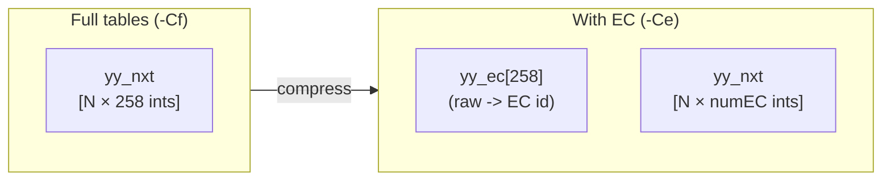

### Stage 2 — Meta-Equivalence Classes (`-Cm`, implies `-Ce`)

**Observation:** after EC compression, some ECs still produce identical next-state rows across all DFA states and can be merged a second time.

**Algorithm in `_computeMetaEC()`:**

1. For each EC, pick one representative raw symbol.
2. Build the EC's *meta-column*: next-state vector using that representative, across all DFA states.
3. Group ECs with identical meta-columns into **Meta-ECs** using the same map-based deduplication.
4. Emit `yy_meta[numEC]` (EC id → meta-EC id).
5. The table shrinks further to `yy_nxt[N][numMetaEC]`.

At runtime: `next = yy_nxt[state][yy_meta[yy_ec[(unsigned char)c]]]`.

### Compression flags summary

| Flag | EC | Meta-EC | Table dimensions |
|---|---|---|---|
| `-f` / `-Cf` (default) | ✗ | ✗ | `N × 258` |
| `-Ce` | ✓ | ✗ | `N × numEC` |
| `-Cm` | ✓ | ✓ | `N × numMetaEC` |
| `-F` / `-CF` | ✓ | ✓ | same as `-Cm` |

The `-v` flag prints the exact table entry count before and after compression so you can measure the savings directly. For pathological grammars, the `-CF` mode routinely achieves the 2× reduction required by the subject.

---

## Bonus: Python Target (`-l python`)

`ft_lex` can emit a self-contained Python scanner via `-l python` (output: `lex.yy.py`).

`PythonGenerator` subclasses `AGenerator` and overrides the five virtual generation methods to emit valid Python instead of C. Action code is translated automatically by `_cleanAction()`:

- `yytext` → `self.yytext`
- `yymore()`, `input()`, `unput()`, `yyless()` → `self.yymore()`, etc.
- Brace-delimited `{ ... }` C action bodies are stripped of their braces and indented as Python statements.

The Python template (`template/template.py`) provides the same overall structure as the C template — global state variables, a `yylex()` method, BOL/anchor handling, and the DFA dispatch loop — implemented natively in Python with the same `yy_nxt`, `yy_accept`, and `yy_sc_start` table conventions.

---